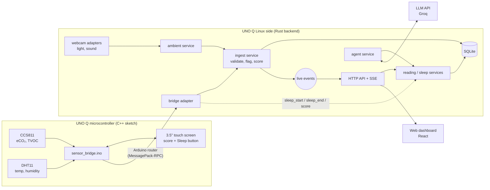
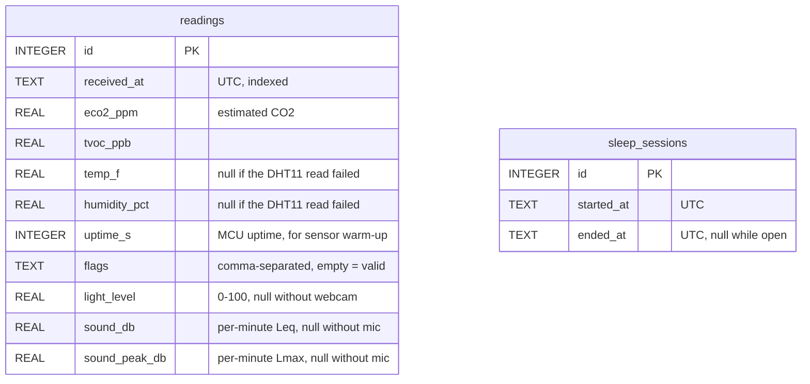

# Hypnos

**Hypnos scores your bedroom, not you.** A small device on your nightstand measures the
air, temperature, humidity, light, and sound in the room every minute, turns them into a
0–100 sleep-environment score, and shows it on a touch screen and a web dashboard. When
the score drops, you can ask the built-in assistant *why*, and it answers from your actual
readings, with every number checked against the data.

Everything runs on the device in your bedroom. No wearable, no health data, no account.
The only thing that leaves your network is a chat question to the AI model, and only
when you ask one.

Built at ShellHacks 2026 on an Arduino UNO Q.

---

## Contents

- [Features](#features)
- [Who it's for](#who-its-for)
- [How it works](#how-it-works)
- [Data flow, end to end](#data-flow-end-to-end)
- [Database](#database)
- [Scoring](#scoring)
- [The assistant](#the-assistant)
- [API](#api)
- [Tech stack](#tech-stack)
- [Hardware](#hardware)
- [Getting started](#getting-started)
- [Privacy and limitations](#privacy-and-limitations)
- [Project layout](#project-layout)
- [What's next](#whats-next)
- [AI tools used](#ai-tools-used)

---

## Features

**Measures the room, every minute**
- **eCO₂ and TVOC** (CCS811): how stuffy the air is. Labeled *estimated* everywhere, because
  the CCS811 infers CO₂ from volatile organic compounds.
- **Temperature and humidity** (DHT11), also fed back to the CCS811 to improve its accuracy.
- **Light and sound** (optional, from a USB webcam): a relative light level (0–100) and
  the sound level in dB (per-minute average and peak). Frames and audio are reduced to
  these numbers in memory and never stored.

**Scores it**
- A 0–100 score per minute from sub-scores for each metric, with target ranges taken from
  published research (see [docs/REFERENCES.md](docs/REFERENCES.md)).
- Bands: **Great** (90+), **Good** (80+), **Fair** (70+), **Poor** (under 70).
- Bad or suspect readings (sensor warm-up, missing values, out-of-range values) are
  flagged and excluded instead of skewing the score.

**On the device (3.5" touch screen)**
- The live score and readings at a glance.
- **Tap to start sleep mode, hold for 1.5 s to end it.** A night is exactly the time you
  were asleep, not a fixed bedtime window.

**Web dashboard** (served by the device, works on your home network or phone hotspot)
- **Home:** live score updated as readings arrive, the biggest problem in one sentence
  ("Room is 6.6 °F above target"), a tile per metric with its target range, and 6-hour
  charts.
- **Sleep:** sleep mode's status, and a morning summary when a night ends.
- **Last night:** the night's score, completeness, lowest-scoring metric, per-metric
  stats, noise events, charts, and a **calendar of every past night**, colored by band.

**Assistant** (chat on the dashboard)
- Ask "Why is my score low?" or "How was last night?". It looks up your data with tools and
  shows which tools it called.
- **Every number in its answer is checked** against the data it looked up. The reply shows
  "✓ numbers verified" or flags the numbers it couldn't verify.
- Recommendations name the metric, its value, the target, and one concrete action. It
  never gives medical advice.
- If the AI service is down, the dashboard and scoring keep working.

---

## Who it's for

- **Anyone who sleeps badly and doesn't know why.** Hypnos shows whether the room is too
  warm, too stuffy, too bright, or too loud, and when.
- **People who don't want a wearable** or don't want to share health data. Hypnos measures
  the room, so there is nothing about your body to collect.
- **Parents** checking a nursery's temperature and air, and **light sleepers** who want
  to see how often noise wakes the room at night.
- **Renters and anyone with poor ventilation** who want evidence that the air gets stale
  overnight (and whether cracking a window helps).
- **Makers:** it's built from off-the-shelf parts on one board, and the sensor layer is
  swappable (a true-CO₂ SCD41 is a one-driver upgrade).

---

## How it works

The Arduino UNO Q has two computers on one board: a **microcontroller** (STM32, real-time,
wired to the sensors and screen) and a **Linux computer** (Qualcomm, Debian). Hypnos uses
both:



- The **MCU sketch** reads the sensors and draws the screen. It sends each reading to Linux
  through the Arduino router, and asks the backend to start or end sleep mode when you
  touch the screen.
- The **Rust backend** receives readings, validates and scores them, stores them in SQLite,
  and serves the dashboard, the API, live updates, and the assistant. It is layered:
  controllers → services → repositories, with adapters for the hardware and the LLM. The
  dashboard and the assistant use the same services, so they can never disagree.
- The **web UI** is built once and embedded in the backend binary, so the device needs no
  Node.js and works fully offline (except for the assistant).

---

## Data flow, end to end

**A reading, from sensor to screen:**

1. **Sense (MCU).** The sketch keeps the latest CCS811 values. Every minute (10 s while
   developing) it reads the DHT11, passes temperature and humidity to the CCS811 for
   compensation, and sends
   `Bridge.notify("reading", eco2, tvoc, temp_f, humidity, uptime_s)`.
   A failed DHT11 read sends `NaN`. The MCU has no clock, so it sends its uptime instead.
2. **Transport.** The Arduino router (a MessagePack-RPC hub on
   `/var/run/arduino-router.sock`) passes the notification to the backend, which registered
   the `reading` method when it connected.
3. **Receive (`adapters/bridge.rs`).** The backend decodes the parameters into a `Reading`
   and timestamps it in UTC on arrival.
4. **Enrich (`services/ambient_service.rs`).** If the webcam is enabled, the latest light
   level and sound levels (if under 2 minutes old) are attached. The camera adapter grabs a
   tiny 32×24 grayscale frame at a fixed exposure each minute. The microphone adapter
   computes per-minute average (Leq) and peak (Lmax) levels from a live audio stream.
5. **Validate and score (`services/ingest_service.rs`, `domain/`).** The reading is rounded
   to display precision, checked for problems (flags such as `warm_up`, `temp_missing`),
   and scored. Flagged readings are kept but not scored.
6. **Store (`repositories/sqlite_repo.rs`).** The reading and its flags are written to
   SQLite.
7. **Publish.** The scored reading is broadcast on an in-process channel. Every open
   dashboard receives it over **Server-Sent Events** (`GET /api/stream`), so the page
   updates without polling.
8. **Show.** The dashboard validates the data (zod) and updates the score, tiles, and
   charts. The LCD asks the backend for the latest score (`Bridge.call("score")`).

**A night:**

1. You tap **Sleep** on the screen → the sketch calls `sleep_start` → the backend opens a
   session in SQLite (only one can be open) and broadcasts it; the dashboard switches to
   sleep mode.
2. In the morning you hold the button → `sleep_end` closes the session.
3. The night report is computed from the stored readings between start and end: score,
   completeness, per-metric stats, lowest metric, and noise events. It appears on
   **Last night** and in the calendar.

**A question to the assistant:**

1. The browser POSTs your message (and recent history) to `/api/chat`.
2. The backend sends it to the LLM with four tools. When the model calls a tool, the
   backend runs it **in-process through the same services as the dashboard** and returns
   the result. The model never touches the database or the hardware.
3. The reply streams back over SSE: tool calls, text, and finally a **grounding check**
   listing any number in the reply that doesn't appear in this turn's tool results.

---

## Database

SQLite, one file (`DB_PATH`, default `sleep-env.db`), in WAL mode. About 1,440 readings per
night at one per minute, so a time-series database isn't needed. Timestamps are UTC,
stored as fixed-width RFC 3339 text (`2026-09-26T06:45:00.123Z`), so text order is time
order and range queries use the index.



| Table | Notes |
| --- | --- |
| `readings` | One row per reading. Index on `received_at`. `flags` holds names like `warm_up,humidity_missing`. The three webcam columns were added later, by a migration that runs on startup, so older databases upgrade in place. |
| `sleep_sessions` | One row per night. A unique partial index allows **at most one open session** (`ended_at IS NULL`). Index on `ended_at` for the history. |

Scores aren't stored. They're computed from the readings when requested, so changing a
target re-scores all history. Nights are not stored either: a night is a session plus
the readings inside it.

---

## Scoring

Each metric gets a 0–100 sub-score. A minute's score is the **average of the available
sub-scores** (so readings without a webcam score on air and climate only).

| Metric | Full points | Falls off | Zero at |
| --- | --- | --- | --- |
| eCO₂ (estimated) | ≤ 800 ppm | linearly | ≥ 2,000 ppm |
| Temperature | 65–70 °F | 10 points per °F outside | ≤ 55 or ≥ 80 °F |
| Humidity | 40–60 % RH | 5 points per % outside | ≤ 20 or ≥ 80 % |
| Light (estimated, webcam) | ≤ 5 | linearly | ≥ 40 |
| Sound (estimated, webcam) | ≤ 30 dB | linearly | ≥ 55 dB |

- **Night score** = the average of the valid minutes between the start and the end of sleep
  mode. A night with fewer than 60 % valid minutes is marked **incomplete**. One under an hour is
  marked **short**.
- **Noise event** = a run of minutes whose peak is above 45 dB (the WHO night-noise
  guideline).
- **Flagged, not scored:** the first 20 minutes after power-on (CCS811 warm-up), a zero or
  out-of-range eCO₂, and missing or impossible temperature or humidity.
- Sources for every target are in [docs/REFERENCES.md](docs/REFERENCES.md). The light
  thresholds are placeholders until calibrated against real rooms.

---

## The assistant

- **Model:** `openai/gpt-oss-120b` on Groq (any OpenAI-compatible API works, set by
  environment variables).
- **Tools:** `get_current`, `get_summary(start, end)`, `get_night_latest`, `get_targets`.
  They call the backend's services directly, the same code the dashboard uses.
- **Grounding check:** every number in the reply must match a number in this turn's tool
  results (or in your own message). The result is shown under the reply.
- **Rules:** CO₂ is always called *estimated (eCO₂)*; missing data is stated, never
  estimated; no medical advice.
- **Limits:** up to 4 tool rounds per question, 20-second timeouts, and an optional
  `CHAT_TOKEN` to protect the LLM quota when the device is reachable from outside your network.

---

## API

Served by the backend (default `http://<device>:8080`). All numbers are rounded the
same way everywhere: eCO₂ and TVOC as whole numbers, everything else to one decimal.

| Method and path | Returns |
| --- | --- |
| `GET /api/current` | The latest reading with its flags, sub-scores, score, and band (404 if none yet). |
| `GET /api/readings?start=&end=` | Every reading in `[start, end)` (RFC 3339), for charts. |
| `GET /api/summary?start=&end=` | Averages, min/max, minutes out of range, and score stats for a time range. |
| `GET /api/targets` | Target ranges, bands, thresholds, and their sources. |
| `GET /api/stream` | Server-Sent Events: `reading` (each new reading) and `sleep` (sleep mode started/ended). |
| `GET /api/sleep/current` | The open sleep session, or `null`. |
| `POST /api/sleep/start`, `POST /api/sleep/end` | Start or end sleep mode (the screen normally does this; 409 if already in that state). |
| `GET /api/night/latest`, `GET /api/night/{id}` | The full report for the last or a given night. |
| `GET /api/nights` | Summaries of every finished night, for the calendar. |
| `POST /api/chat` | Ask the assistant; replies stream as SSE (`tool_call`, `token`, `done` with the grounding result). |
| `GET /`, `/sleep`, `/last-night` | The web UI. |

---

## Tech stack

| Layer | Technology |
| --- | --- |
| Board | Arduino UNO Q: STM32U585 MCU (Zephyr) + Qualcomm QRB2210 running Debian Linux |
| Sensors | CCS811 (eCO₂, TVOC, I²C), DHT11 (temperature, humidity), Logitech C922 webcam (light, sound) |
| Screen | 3.5" 480×320 SPI TFT (ILI9486) with XPT2046 touch |
| Firmware | C++ sketch in Arduino App Lab, `Arduino_RouterBridge`, Adafruit CCS811 / DHT / GFX libraries |
| MCU ↔ Linux | Arduino router (MessagePack-RPC over a Unix socket), `rmpv` on the Rust side |
| Backend | Rust, Tokio, Axum 0.8, `rusqlite` (SQLite, bundled), `serde`, `chrono`, `tracing`, `rust-embed` |
| Webcam | `v4l2-ctl` + `ffmpeg` (light frames), `arecord` (audio), processed in Rust |
| Assistant | `async-openai` (streaming, tool calling) → Groq `openai/gpt-oss-120b` |
| Frontend | React 19, TypeScript, Vite, Tailwind CSS v4, shadcn/ui, zod, Recharts |
| Live updates | Server-Sent Events |

Why these choices:
- **Hybrid C++ / Rust.** The official App Lab tooling and sensor libraries are C++, so the
  MCU stays C++. Everything on Linux is Rust for safety and a single small binary.
- **SQLite** because one night is ~1,440 rows. It needs no server and survives power loss (WAL).
- **SSE, not WebSockets,** because updates only flow one way (server → browser), and SSE
  reconnects on its own.
- **Embedded UI** so the device is one binary with no runtime dependencies.

---

## Hardware

| Part | Connection on the UNO Q |
| --- | --- |
| Breadboard + / − rails | 3.3 V / GND (the board has one 3.3 V pin, shared by both sensors) |
| CCS811 | VCC → + rail, GND and **WAKE** → − rail, SDA/SCL → SDA/SCL (next to AREF). INT, RST unconnected. |
| DHT11 | V → + rail, S → digital pin 2, G → − rail |
| 3.5" SPI screen | LCD CS 10, DC 9, RST 8, SPI 11/12/13 |
| Touch (XPT2046) | CS 7, shared SPI |
| USB webcam (optional) | USB (the board has one USB-C port, so use a USB-C hub) |

Tips: keep the DHT11 a few inches from the board (board heat reads high), and wait about
20 minutes after power-on for the CCS811 to settle. Hand sanitizer near the CCS811 makes a
good demo spike.

---

## Getting started

### 1. Firmware (Arduino App Lab)

1. Create an app (or copy an example), and paste `firmware/sensor_bridge.ino` as its sketch.
2. Under **Sketch Libraries**, add *DHT sensor library*, *Adafruit Unified Sensor*,
   *Adafruit CCS811 Library*, and *Adafruit GFX Library* (libraries are per app).
3. Run it. The screen shows the score once the backend is running.

### 2. Backend (on the UNO Q, over SSH)

```bash
sudo apt install build-essential pkg-config libssl-dev   # once
# optional, for light and sound:
sudo apt install ffmpeg v4l-utils alsa-utils

git clone <this repo> && cd Smart-Sleeping-System-Shellhacks
cp .env.example .env        # add LLM_API_KEY and LLM_MODEL for the assistant
cargo build --release -p backend
./target/release/backend    # serves http://<board>.local:8080
```

Run it in `tmux` (or as a service) for overnight recording. Every setting is in
[.env.example](.env.example): the LLM settings, the chat token, the webcam devices and
calibration, and the database path.

### 3. Open the dashboard

Go to `http://<board-name>.local:8080` from any device on the same network (a phone
hotspot works well for demos).

### Developing the UI

```bash
cd frontend
npm install
npm run dev                  # http://localhost:5173, proxies /api to the board
npm run build                # writes dist/; commit it (the backend embeds it)
```

### Tests

```bash
cargo test -p backend        # scoring, validation, storage, API, agent, grounding
cargo clippy -p backend
```

---

## Privacy and limitations

**Privacy**
- All readings stay on the device, in a local SQLite file.
- The webcam is used as a light meter and a sound meter: each frame and each second of audio is
  reduced to a number in memory and discarded. No images or audio are ever stored or sent.
- The only outbound traffic is the assistant: your question and the tool results it needs
  go to the LLM provider. Without an API key, nothing leaves the device.
- No accounts, no health data, no body measurements.

**Limitations**
- The CCS811 **estimates** CO₂ from VOCs; it is not a true CO₂ sensor (an SCD41 would be).
  Breath barely registers, while VOC sources (cleaning products, sanitizer) spike it.
- The DHT11 is coarse (±2 °C, ±5 % RH).
- Light and sound are **estimates** from a consumer webcam. Sound is calibrated against a
  phone sound meter, and the light thresholds still need calibration.
- Scores describe the room against published targets. They are not a sleep-quality or
  medical measurement.

---

## Project layout

```
├── firmware/sensor_bridge.ino   # MCU sketch: sensors, screen, touch, bridge calls
├── backend/src/
│   ├── main.rs                  # wiring: repositories → services → router, background tasks
│   ├── config.rs                # settings from the environment / .env
│   ├── domain/                  # pure logic: readings, flags, scoring, nights, grounding
│   ├── adapters/                # router bridge, camera, microphone, LLM client
│   ├── services/                # ingest, readings, sleep, ambient, device, agent
│   ├── repositories/            # storage traits + SQLite implementations
│   └── controllers/             # HTTP routes, SSE, chat, embedded frontend
├── frontend/                    # React dashboard (dist/ is committed and embedded)
├── router-test/                 # small tool to inspect messages on the Arduino router
└── docs/
    ├── DESIGN.md                # screens, states, colors
    └── REFERENCES.md            # sources for the scoring targets
```

---

## What's next

- **True CO₂:** swap the CCS811 for an SCD41. Only the driver changes.
- **Light calibration** against dark, lamp-lit, and bright rooms.
- **Cloud mirror (built, not deployed):** an AWS version of the same backend (Lambda +
  DynamoDB + CloudFront, defined with the CDK), where the device uploads its data and each
  user signs in with Google to see their own room from anywhere. It lives on the
  `feature/aws-cloud` and `feature/auth` branches.
- **Trends across nights** in the assistant ("Is my room getting better this week?").
- **Actions:** turn on a fan or a humidifier when a metric leaves its range.

---

## AI tools used

As required by the hackathon rules:
- **Claude Code** (Anthropic, Claude models) helped write code, tests, and documentation
  in this repository.
- **The in-app assistant** runs on **`openai/gpt-oss-120b`**, served by **Groq**.
